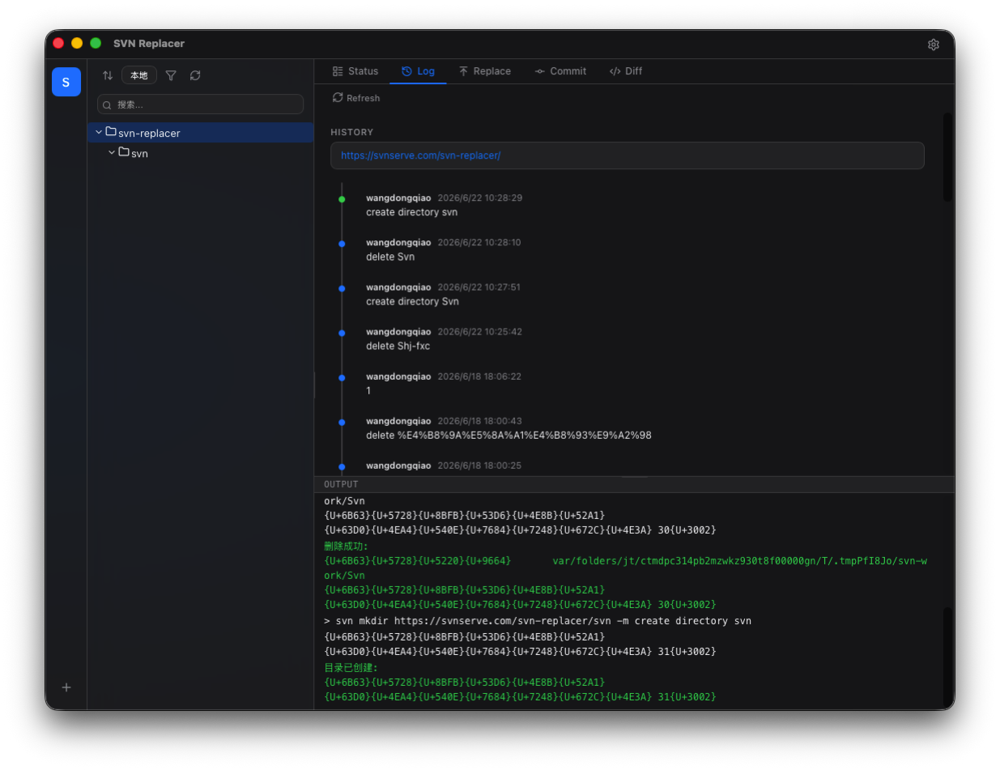

# SVN Replacer

一个基于 Tauri 的图形化 SVN 客户端，支持远程仓库浏览、文件替换、提交管理等操作。

## 功能

- **远程仓库浏览** — 以树形结构浏览 SVN 仓库目录，支持按日期排序、按扩展名筛选
- **本地目录浏览** — 浏览本地文件系统，实时显示 SVN 状态徽标（M/A/D/?/C/!）
- **替换与提交** — 选择本地文件/目录，直接上传替换远程 SVN 上的对应内容
- **文件重命名** — 右键远程文件/目录进行重命名
- **新建目录** — 右键远程目录快速创建子目录
- **提交管理** — 工作副本更新、添加、删除、还原、清理
- **提交历史** — 查看指定文件/目录的 SVN log 时间线
- **文件差异** — 查看文件最新版本的 Diff

## 预览



## 技术栈

- **前端**: React 19 + TypeScript + Vite
- **桌面框架**: Tauri v2
- **后端**: Rust（通过 Tauri commands 调用 SVN CLI）
- **SVN**: 系统 SVN 命令行客户端

## 开发

```bash
# 安装依赖
pnpm install

# 启动开发模式
pnpm tauri dev

# 构建生产版本
pnpm tauri build
```

## 环境要求

- Node.js 20+
- pnpm
- Rust toolchain
- SVN 命令行客户端（`svn` 在 PATH 中）
